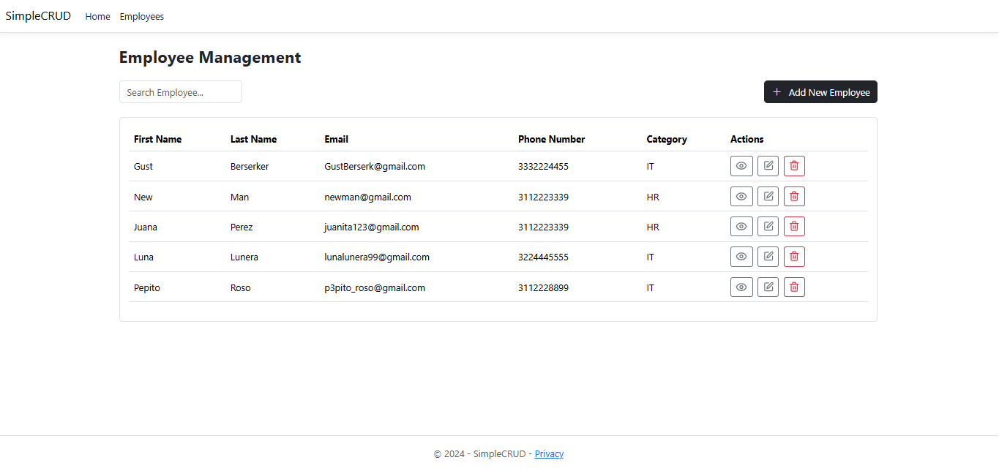
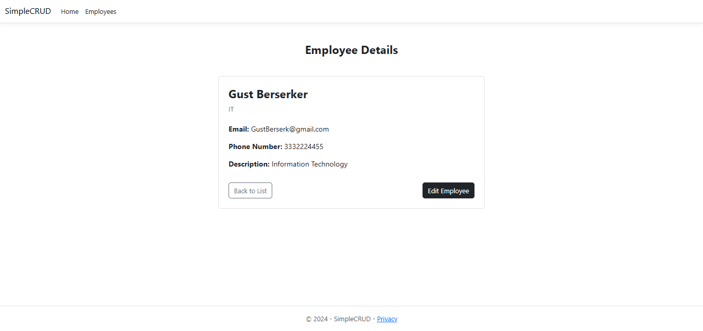
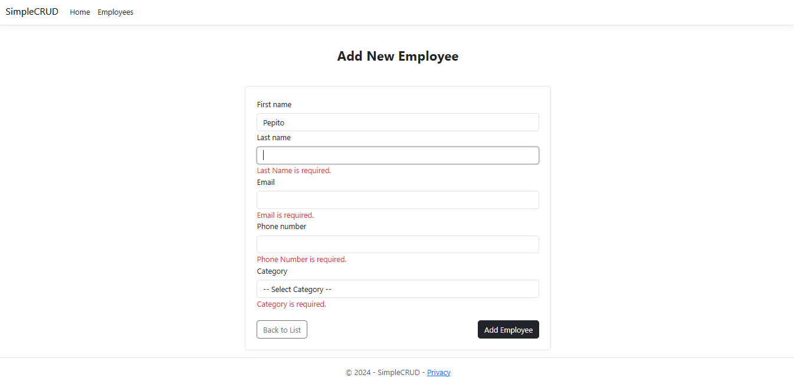
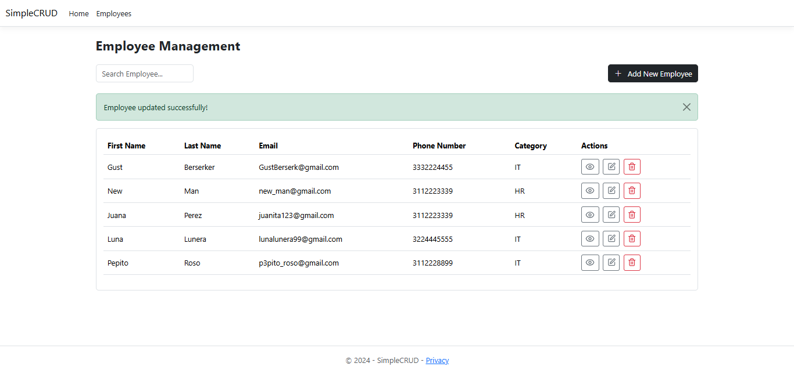
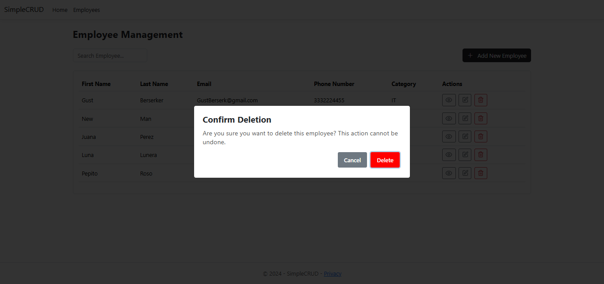

# ASP.NET MVC SIMPLE CRUD

This project is a basic CRUD application that implements essential functionalities for employee management. It includes create, read, update, and delete operations, along with a search feature by first and last name. The project also incorporates confirmation messages, server-side form validation, and a responsive design using Bootstrap. Data persistence is handled using Entity Framework (EF) with a SQLite database, ensuring portability and simplicity during development.

## INSTALLATION

Clone the repository.

```bash
gh repo clone nicds-dev/SimpleCRUD-ASP.NET
```

Run application.

```bash
dotnet run
```

## VIEWS

Home:



Detail:



Add/Update:



Success message:



Delete modal:


